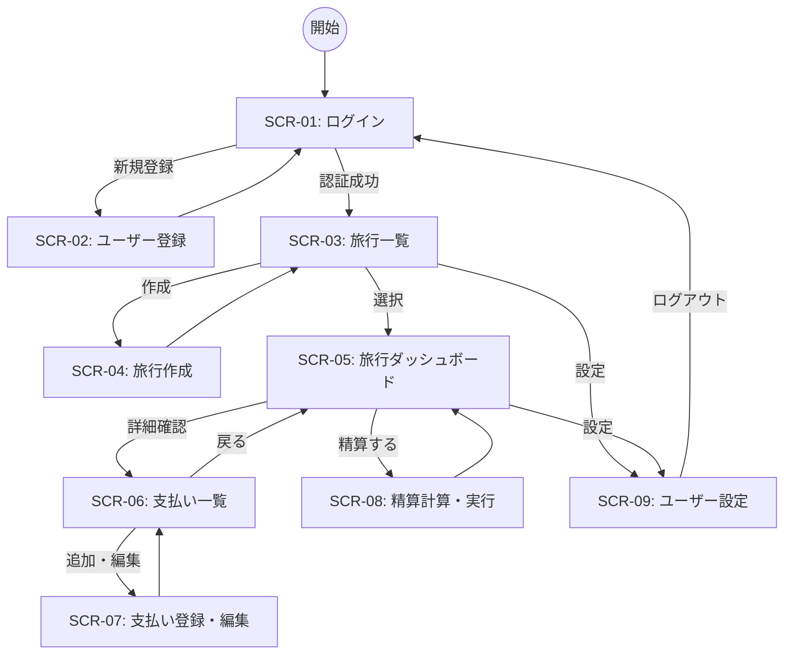

# 旅行支払い精算アプリ 画面設計書

本ドキュメントは、旅行支払い精算アプリのフロントエンドにおける画面一覧、遷移図、および各画面の基本仕様を定義します。

## 1. 画面一覧

| 画面ID | 画面名称 | 概要 | アクセス権限 |
| :--- | :--- | :--- | :--- |
| SCR-01 | ログイン | メールアドレスとパスワードによる認証。 | 未ログイン |
| SCR-02 | ユーザー登録 | 新規アカウントの作成。 | 未ログイン |
| SCR-03 | 旅行一覧 | 参加している旅行のリスト表示、新規作成ボタン。 | ログイン済 |
| SCR-04 | 旅行作成 | 旅行名、期間、メンバー招待の設定。 | ログイン済 |
| SCR-05 | 旅行ダッシュボード | 選択した旅行の概要、メンバー、合計支出の表示。 | 旅行参加者 |
| SCR-06 | 支払い一覧 | 旅行に関連する全支払い記録のリスト。 | 旅行参加者 |
| SCR-07 | 支払い登録・編集 | 金額、項目、カテゴリ、写真の登録。 | メンバー以上 |
| SCR-08 | 精算計算・実行 | 貸し借りの算出結果表示と精算完了処理。 | 旅行参加者 |
| SCR-09 | ユーザー設定 | プロフィール編集、ログアウト。 | ログイン済 |

## 2. 画面遷移図

## 3. 主要画面の基本仕様

### 3.1 旅行ダッシュボード (SCR-05)
- **目的**: 旅行の現在のステータスを一目で把握する。
- **表示項目**: 
    - 旅行名、期間、残日数、予算進捗バー。
    - 参加メンバー（アイコン表示）。
    - 自分の負担額と精算予定額のサマリー。
- **操作**: 支払い一覧への遷移、精算機能への遷移、メンバー招待。

### 3.2 支払い登録・編集 (SCR-07)
- **目的**: 発生した費用を速やかに記録する。
- **表示項目**: 
    - 金額（数値入力）、支払い項目（テキスト）、カテゴリ（選択）、日付（カレンダー）。
    - 写真添付エリア（レシート等の撮影用）。
- **操作**: 保存、キャンセル、画像アップロード。

### 3.3 精算計算・実行 (SCR-08)
- **目的**: 複雑な貸し借りを整理し、支払い導線を提示する。
- **表示項目**: 
    - 「AさんからBさんへ 1500円」といった精算リスト。
    - 精算ステータス（完了・未完了）。
- **操作**: 全員分を一括で確認、または特定の精算を「完了」にする。

## 4. UI/UX 方針
- **Angular Material の活用**: 一貫性のあるモダンなコンポーネント（Cards, Buttons, Inputs）を使用します。
- **レスポンシブ**: 旅行記中での利用を想定し、モバイルデバイス（スマートフォン）での操作性を最優先します。
- **フィードバック**: データの保存成功やエラー時にはのスナックバー（通知）を表示し、ユーザーに状態を伝えます。

---

*この画面設計書は開発の進行に応じて更新される場合があります。*
