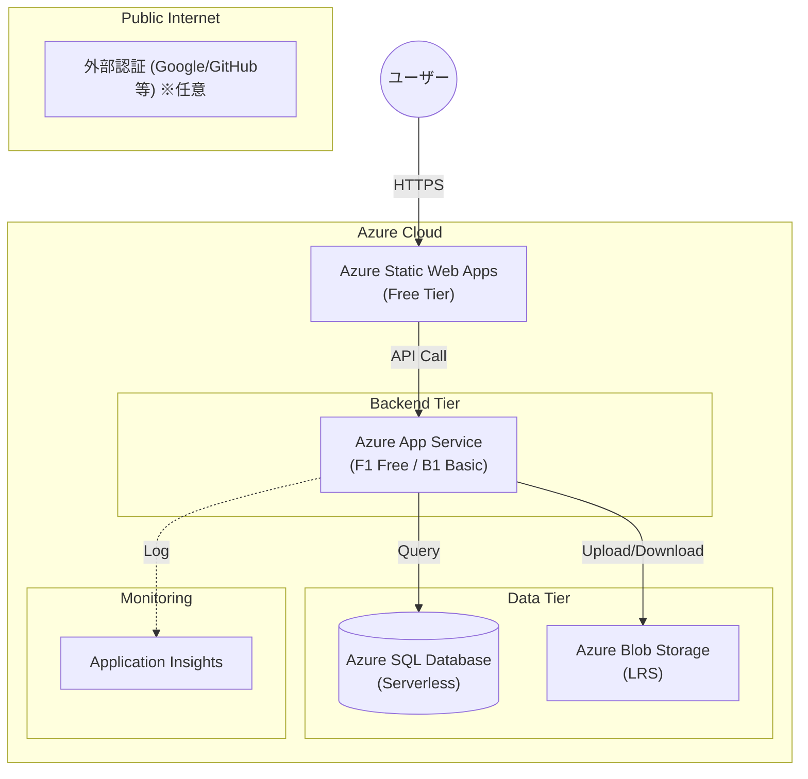

# 旅行支払い精算アプリ システム構成図

本ドキュメントは、少人数（数人）での個人・友人利用を想定した、最小コストで運用可能なクラウドシステム構成を定義します。

## 1. 全体構成図

Azure の無料枠および従量課金プランを最大限活用し、月額コストを最小限に抑えた構成です。

## 2. 採用コンポーネントと選定理由

| コンポーネント | サービス名 | 選定理由 (コスト最適化) | 概算コスト |
| :--- | :--- | :--- | :--- |
| **フロントエンド** | Azure Static Web Apps | **Free Tier**: 数人規模であれば完全無料でホスティング可能です。 | 無料 |
| **バックエンド API** | Azure App Service | **F1 Free Tier**: 24時間稼働が不要なら無料枠、安定性を求めるなら **B1 Basic**（月額約1.5k〜）を選定。 | 無料 〜 ¥1,500/月 |
| **データベース** | Azure SQL Database | **Serverless Tier**: 実行時のみ課金。利用がない間は自動一時停止するように設定することで、コストを最小化。 | ¥数円 〜 ¥500/月 |
| **画像ストレージ** | Azure Blob Storage | **LRS (Locally Redundant)**: 支払い証明画像等の保存。数人分の利用量（数GB）なら極めて安価です。 | ¥100以内/月 |
| **監視・分析** | Application Insights | **基本枠**: 一定のデータ転送量までは無料枠内で収まります。 | 無料 |

## 3. コスト削減のための運用方針

### 3.1 データベースの自動一時停止
Azure SQL Database のサーバーレス構成では、「自動一時停止」の間隔を設定できます（例：1時間）。深夜など誰も利用していない時間は、インスタンスを停止状態にすることで、ストレージ料金（月数百円程度）のみの支払いに抑えます。

### 3.2 開発プロジェクトのクリーンアップ
不要なリソースを放置しないよう、Azure Resource Group を一つにまとめ、プロジェクト終了後や実験用リソースは速やかに削除します。

### 3.3 リージョンの選定
東日本リージョン（Japan East）は比較的安定していますが、コスト最優先の場合は米国リージョンの一部など、より安価なリージョンを選択することも検討の余地があります。

---

*このシステム構成図は、利用規模や機能拡張に応じて見直される場合があります。*
