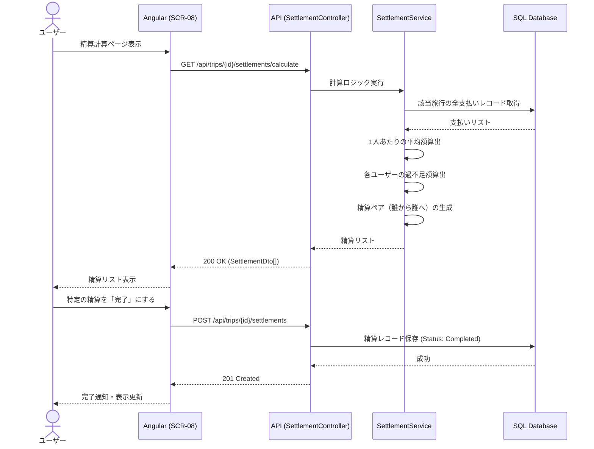
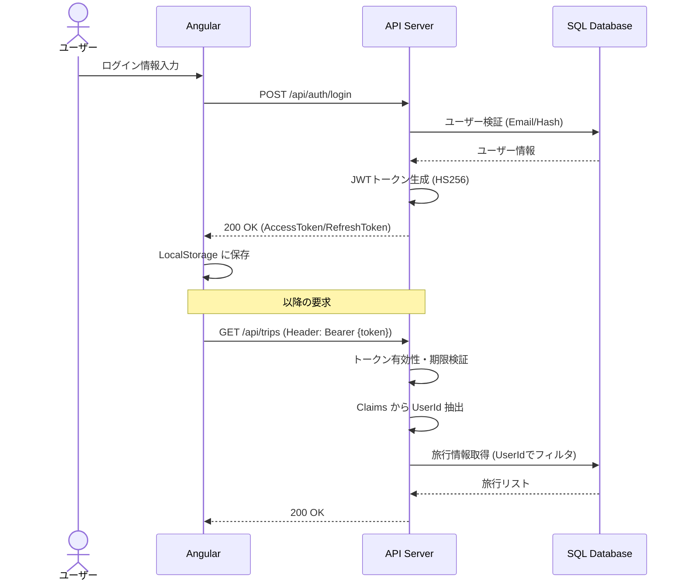

# シーケンス図

## 1. 精算計算・実行フロー
貸し借りを計算し、実際に特定のユーザーへ支払いを完了する際の流れ。

```mermaid
sequenceDiagram
    actor User as ユーザー
    participant UI as Angular (SCR-08)
    participant API as API (SettlementController)
    participant Srv as SettlementService
    participant DB as SQL Database

    User->>UI: 精算計算ページ表示
    UI->>API: GET /api/trips/{id}/settlements/calculate
    API->>Srv: 計算ロジック実行
    Srv->>DB: 該当旅行の全支払いレコード取得
    DB-->>Srv: 支払いリスト
    Srv->>Srv: 1人あたりの平均額算出
    Srv->>Srv: 各ユーザーの過不足額算出
    Srv->>Srv: 精算ペア（誰から誰へ）の生成
    Srv-->>API: 精算リスト
    API-->>UI: 200 OK (SettlementDto[])
    UI-->>User: 精算リスト表示

    User->>UI: 特定の精算を「完了」にする
    UI->>API: POST /api/trips/{id}/settlements
    API->>DB: 精算レコード保存 (Status: Completed)
    DB-->>API: 成功
    API-->>UI: 201 Created
    UI-->>User: 完了通知・表示更新
```

## 2. 認証・認可フロー (JWT)
ログインから API 呼び出しにおけるトークン検証の流れ。

```mermaid
sequenceDiagram
    actor User as ユーザー
    participant UI as Angular
    participant API as API Server
    participant DB as SQL Database

    User->>UI: ログイン情報入力
    UI->>API: POST /api/auth/login
    API->>DB: ユーザー検証 (Email/Hash)
    DB-->>API: ユーザー情報
    API->>API: JWTトークン生成 (HS256)
    API-->>UI: 200 OK (AccessToken/RefreshToken)
    UI->>UI: LocalStorage に保存

    Note over UI, API: 以降の要求
    UI->>API: GET /api/trips (Header: Bearer {token})
    API->>API: トークン有効性・期限検証
    API->>API: Claims から UserId 抽出
    API->>DB: 旅行情報取得 (UserIdでフィルタ)
    DB-->>API: 旅行リスト
    API-->>UI: 200 OK
```
